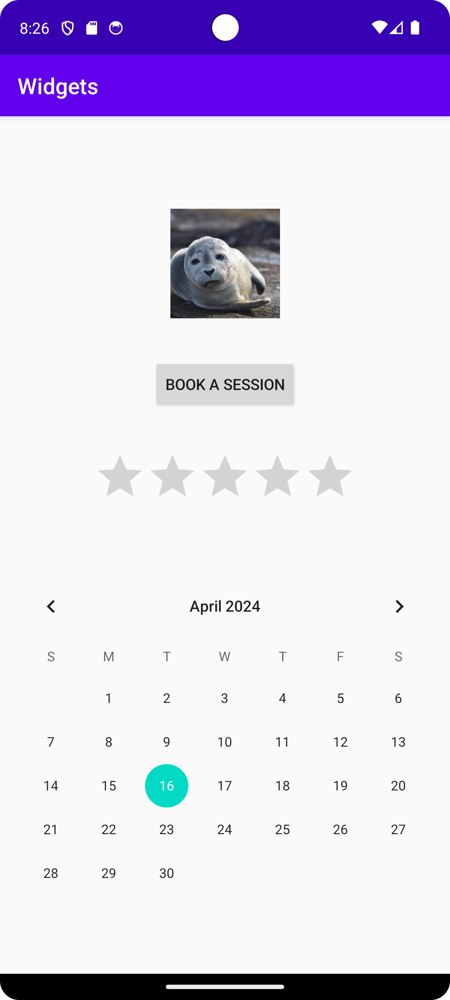

# Rapport
Nedanför har vi kod exempel på hur en widget ser ut, i detta fall för knappen som används. 
I <button/> elementet hittar vi först id för knappen, width och height är satt till wrap content
så knappen blir lika stor som krävs för innehållet, dvs texten i knappen. Därefter kommer vad för
text som ska stå. Till sist har vi constraints, left/right är satt till parent för att få den till
mitten, top och bottom har constraints med elementen ovanför/under för att få knappen mellan
imageview och ratingbar widget föremålen.

Bilden som används i imageview ligger under public domain:
https://openverse.org/image/e7711433-fba9-4906-b981-e1ff714da9a9?q=seal

```
        <Button
            android:id="@+id/button"
            android:layout_width="wrap_content"
            android:layout_height="wrap_content"
            android:text="Book a session"
            app:layout_constraintTop_toBottomOf="@+id/imageView"
            app:layout_constraintBottom_toTopOf="@+id/ratingBar"
            app:layout_constraintLeft_toLeftOf="parent"
            app:layout_constraintRight_toRightOf="parent"/>
```




